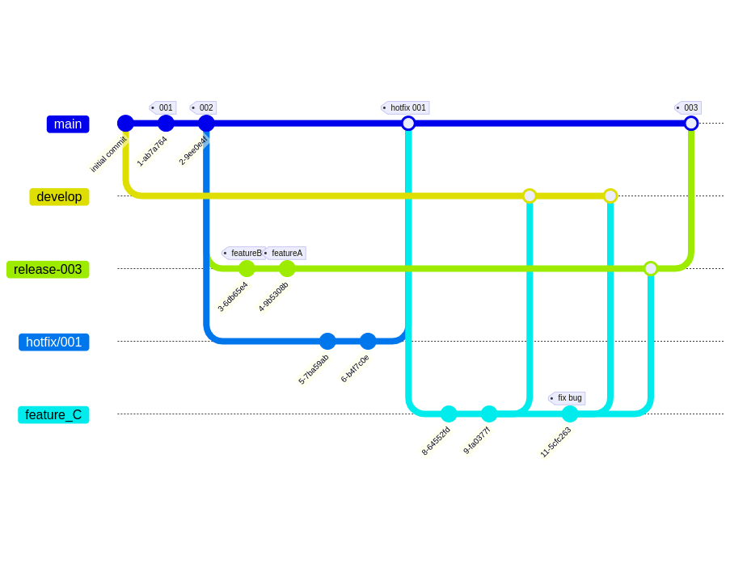

##Designer concept creator MVP server##

Monolithic server application for application for writing game concepts and linear storytelling. This server is written in Spring, supports password authorization and changing privileges when changing projects. He will also need to:

- Store data of system users and their subscriptions and starting privileges;
- Create promotions, which is necessary for alpha testing of subscriptions;
- Data of projects and user participation in them;
- Accept a script from the application and turn it into a Word document using Apache POI.

This is only a demo version, because for the full operation of the application you will need the ability to store project data. It is also possible to switch to microservices, but not within this repository.
Also, the purpose of this project is rather the acquisition of skills and feedback on them, rather than commercial activities.

##Gitflow##

Elements:
- The main branch corresponds to the product
- Development branch - corresponds to development versions for preliminary testing.
- Hotfix is necessary to quickly fix errors in production
- Release branches are merged when a new version is released that contains all the features of the release.
- A feature branch is created for each task

  The developer first merges into the dev branch, tests, then merges into the release branch and tests before release, then merges into the master branch

##Plans##

- Do this repo great again
- Contain all gitflic version
- Write all tests
